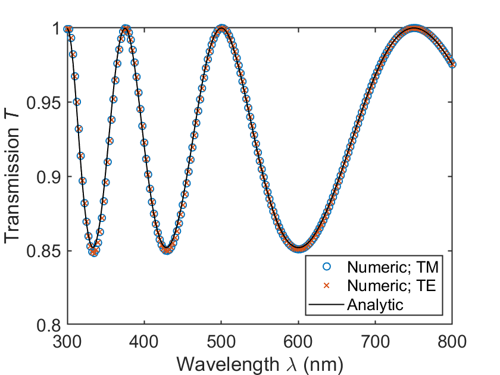

# Fabry-Pérot etalon


Transmission through a dielectric slab, also called a Fabry-Pérot etalon.

In this example, we use mesti2s() to compute the 

1. field profile, 
2. transmission spectrum, and 
3. convergence of discretization error for a Fabry-Pérot etalon at normal incidence.


For a 1D system at normal incidence, the TM and TE polarizations are equivalent, and we will explicit check this equivalence.

# Field profile

```matlab
% System parameters
n_bg = 1;         % refractive index of the background material (air)
n_slab = 1.5;     % refractive index of the dielectric slab (glass)
thickness = 500;  % thickness of the dielectric slab [nm]

syst.polarization = 'TM'; % use TM, which gives the Ez component
syst.epsilon_L = n_bg^2;  % relative permittivity on the left
syst.epsilon_R = n_bg^2;  % relative permittivity on the right
syst.length_unit = 'nm';
syst.wavelength = 550;    % take lambda = 550 nm for this example
syst.dx = syst.wavelength/n_slab/20; % grid size; 20 points per wavelength in slab
syst.yBC = 'periodic';    % 1D system at normal incidence has periodic boundary in y

% Build the relative permittivity profile with subpixel smoothing
syst.epsilon = build_epsilon_fp(syst.dx, n_bg, n_slab, thickness);

% Include field profile in air for plotting purpose
opts.nx_L = round(syst.wavelength/syst.dx); % number of pixels on the left
opts.nx_R = round(syst.wavelength/syst.dx); % number of pixels on the right
opts.verbal = false; % suppress output information

% Compute the field profile with incidence from the left
Ez = mesti2s(syst, {'left'}, [], opts);

% Animate the field profile
nperiod = 2; % number of periods to animate
nframes_per_period = 50; % number of frames per period
nx = size(syst.epsilon, 2); % number of grid points of Ez inside the scattering region
x = (-(opts.nx_L-0.5):(nx+opts.nx_R))*syst.dx;
y_max = 1 + ceil(max(abs(Ez)));
figure
for ii = 1:nperiod
    for jj = 1:nframes_per_period
        clf
        plot(x, real(Ez*exp(-1i*2*pi*jj/nframes_per_period)), 'linewidth', 2)
        patch([0 0 thickness thickness], y_max*[-1 1 1 -1], 'black', 'FaceAlpha', 0.1, 'EdgeColor', 'none', 'LineStyle', 'none')
        xlim([x(1), x(end)])
        ylim(y_max*[-1, 1])
        xlabel('{\itx} (nm)')
        ylabel('Re({\itE_z})')
        text(-300, 3.5, 'air', 'FontSize', 14)
        text(175, 3.5, 'glass', 'FontSize', 14)  
        text(750, 3.5, 'air', 'FontSize', 14)        
        set(gca, 'fontsize', 15, 'FontName', 'Arial')
        drawnow
        pause(0.05)
    end
end
```


# Transmission spectrum


Here, we compute the transmission and reflection spectra for both TM and TE polarizations (which are equivalent for a 1D system at normal incidence).

```matlab
lambda_min = 300; % minimum vacuum wavelength [nm]
lambda_max = 800; % maximum vacuum wavelength [nm]
delta_lambda = 2.5; % increment of the wavelength [nm]

lambda_list = lambda_min:delta_lambda:lambda_max; % wavelength list
n_lambda = numel(lambda_list); % number of wavelengths
lambda_0 = lambda_list(round((n_lambda+1)/2)); % central wavelength [nm]

% For TM polarization, we use the previous syst but with a finer discretization.
syst_TM = syst; clear syst
syst_TM.dx = lambda_min/n_slab/20; % grid size; 20 points per shortest wavelength in slab
syst_TM.epsilon = build_epsilon_fp(syst_TM.dx, n_bg, n_slab, thickness);

% For TE polarization, we need to provide inv_epsilon instead.
% For a 1D system at normal incidence, syst_TE.inv_epsilon{1} is not necessary because the y derivative vanishes.
% Here, syst_TE.inv_epsilon{2} is simply 1./syst_TM.epsilon because the interfaces' normal vectors are in x direction. In 2D and 3D, subpixel smoothing would require more care, for example see Opt. Lett. 31, 2972 (2006).
syst_TE = rmfield(syst_TM, 'epsilon');
syst_TE.polarization = 'TE';
syst_TE.inv_epsilon{2} = 1./syst_TM.epsilon;

opts = []; % clear opts from above
opts.verbal = false; % suppress output information

r_list_TM = zeros(1,n_lambda);
r_list_TE = zeros(1,n_lambda);
t_list_TM = zeros(1,n_lambda);
t_list_TE = zeros(1,n_lambda);

% Loop over wavelengths
for ii = 1:n_lambda
    syst_TM.wavelength = lambda_list(ii);
    syst_TE.wavelength = lambda_list(ii);
       
    % Compute the scattering matrix with input from the left, output to both sides
    % This gives smatrix = [r; t]
    smatrix_TM = mesti2s(syst_TM, {'left'}, {'left', 'right'}, opts);
    smatrix_TE = mesti2s(syst_TE, {'left'}, {'left', 'right'}, opts);

    r_list_TM(ii) = smatrix_TM(1,1);
    r_list_TE(ii) = smatrix_TE(1,1);
    t_list_TM(ii) = smatrix_TM(2,1);
    t_list_TE(ii) = smatrix_TE(2,1);
end

% Check that TM and TE give the same results
% Note that r_TM = -r_TE because the reflection coefficient is defined based on Ez in TM, Hz in TE.
fprintf(['max(|r_TM + r_TE|) = %6.3g\n', ...
         'max(|t_TM - t_TE|) = %6.3g\n'], ...
        max(abs(r_list_TM + r_list_TE)), ...
        max(abs(t_list_TM - t_list_TE)));
```


```
max(|r_TM + r_TE|) = 2.61e-14
max(|t_TM - t_TE|) =  7e-14
```


```matlab
% Check energy conservation
fprintf('max(|1 - T - R|) = %6.3g\n', max(abs(1-abs(r_list_TM).^2-abs(t_list_TM).^2)));
```


```
max(|1 - T - R|) = 4.55e-15
```


```matlab
% Analytic solution
[r_list_analytical, t_list_analytical] = fp_analytical(n_bg, n_slab, thickness, lambda_list);

% Plotting
clf
plot(lambda_list, abs(t_list_TM).^2, 'o', 'linewidth', 1)
hold on
plot(lambda_list, abs(t_list_TE).^2, 'x', 'linewidth', 1)
plot(lambda_list, abs(t_list_analytical).^2, 'k-', 'linewidth', 1)
xlabel('Wavelength \lambda (nm)')
ylabel('Transmission{\it T}')
xlim([lambda_min, lambda_max])
ylim([0.8, 1])
legend('Numeric; TM', 'Numeric; TE', 'Analytic', 'Location', 'southeast')
set(gca, 'fontsize', 15, 'FontName', 'Arial')
set(gca, 'linewidth', 1)
```




# Discretization error


Here we check the scaling of discretization error.

```matlab
n_resolution = 20; % number of discretization resolutions to consider
resolution_list = round(10.^(linspace(1, 3, n_resolution))); % resolutions to consider

% Reduce the wavelength range, so lambda/dx doesn't vary as much
lambda_min = 500; % minimum vacuum wavelength [nm]
lambda_max = 600; % maximum vacuum wavelength [nm]
delta_lambda = 5; % increment of the wavelength [nm]

lambda_list = lambda_min:delta_lambda:lambda_max; % wavelength list
n_lambda = numel(lambda_list); % number of wavelengths
lambda_0 = lambda_list(round((n_lambda+1)/2)); % central wavelength [nm]

% Analytic solution
[r_list_analytical, t_list_analytical] = fp_analytical(n_bg, n_slab, thickness, lambda_list);
R_list_analytical = abs(r_list_analytical).^2;

RMSE_list = zeros(1,n_resolution);
R_list = zeros(1,n_lambda);

% Loop over discretization resolutions
for ii = 1:n_resolution

    % Build the relative permittivity profile with subpixel smoothing
    syst_TM.dx = lambda_0/resolution_list(ii);
    syst_TM.epsilon = build_epsilon_fp(syst_TM.dx, n_bg, n_slab, thickness);

    % Compute reflection on the left for nearby wavelengths
    for jj = 1:n_lambda
        syst_TM.wavelength = lambda_list(jj);
        R_list(jj) = abs(mesti2s(syst_TM, {'left'}, {'left'}, opts))^2;
    end

    % Root-mean-square error due to discretization
    RMSE_list(ii) = sqrt(mean((R_list-R_list_analytical).^2));
end

% dx^2 scaling curve
dx2 = (resolution_list/resolution_list(end)).^(-2)*RMSE_list(end);

% Plotting
clf
loglog(resolution_list, RMSE_list, 'o', 'linewidth', 1)
hold on
loglog(resolution_list, dx2, 'k-', 'linewidth', 1)
grid on
xticks(10.^(1:3))
yticks(10.^(-6:0))
xlabel('Resolution \lambda_0/\Delta{\itx}')
ylabel('RMS difference from analytic')
legend('Data', 'O(\Delta{\itx}^2)')
set(gca, 'fontsize', 15, 'FontName', 'Arial')
set(gca, 'linewidth', 1)
```

